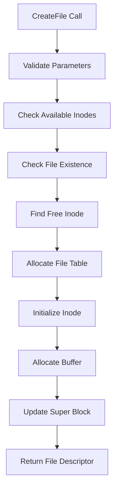
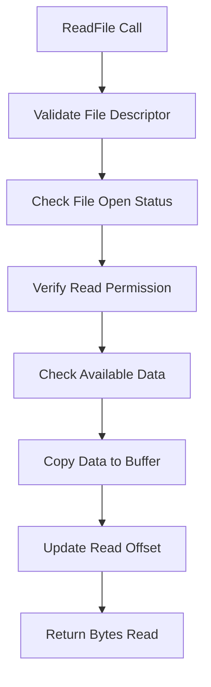
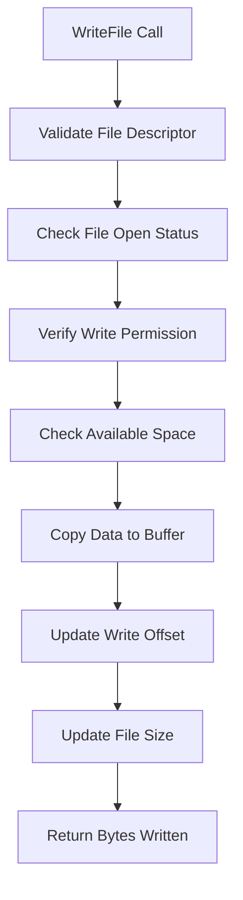
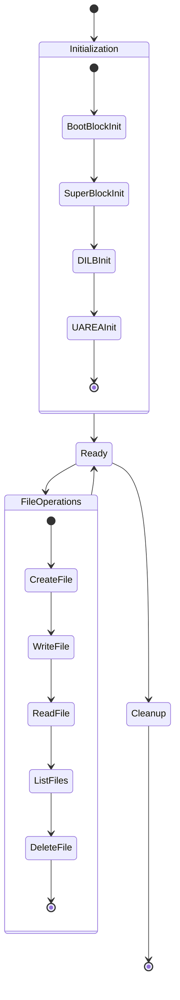

# Linux CVFS - Architecture Documentation

This document provides a detailed architectural overview of the Linux Custom Virtual File System (CVFS), explaining its design principles, components, and data flow.

## Table of Contents

- [System Overview](#system-overview)
- [Architecture Components](#architecture-components)
- [Data Flow](#data-flow)
- [Memory Management](#memory-management)
- [File System Layout](#file-system-layout)
- [Process Model](#process-model)
- [Design Patterns](#design-patterns)
- [Performance Considerations](#performance-considerations)
- [Limitations and Trade-offs](#limitations-and-trade-offs)

## System Overview

Linux CVFS is a simplified file system implementation that simulates core Unix-like file system operations. It provides a virtual file system layer that manages files, directories, and metadata without requiring actual disk storage.

### Key Design Principles

1. **Simplicity**: Easy to understand and modify
2. **Modularity**: Clear separation of concerns
3. **Educational Value**: Demonstrates file system concepts
4. **Memory-based**: All operations in RAM for speed
5. **Single-threaded**: No concurrency complexity

## Architecture Components

### 1. Boot Block

The boot block contains system initialization information and serves as the entry point for the file system.

```cpp
struct BootBlock {
    char Information[100];  // Boot process information
};
```

**Purpose:**
- Stores boot process information
- Provides system identification
- Acts as file system signature

**Characteristics:**
- Fixed size (100 bytes)
- Read-only after initialization
- First component in memory layout

### 2. Super Block

The super block manages file system metadata and resource allocation.

```cpp
struct SuperBlock {
    int TotalInodes;    // Total number of inodes
    int FreeInodes;     // Number of available inodes
};
```

**Purpose:**
- Tracks inode allocation
- Manages file system capacity
- Provides resource availability information

**Key Functions:**
- Inode allocation tracking
- Resource exhaustion detection
- File system state management

### 3. Inode Management (DILB)

The Directory Inode List Block (DILB) is implemented as a linked list of inodes.

```cpp
typedef struct Inode {
    char FileName[50];      // File name
    int InodeNumber;        // Unique identifier
    int FileSize;           // Allocated size
    int ActualFileSize;     // Used size
    int FileType;           // File type
    int ReferenceCount;     // Active references
    int LinkCount;          // Hard link count
    int Permission;         // Access permissions
    char *Buffer;           // Data storage
    struct Inode *next;     // Next inode pointer
} INODE, *PINODE, **PPINODE;
```

**Purpose:**
- Stores file metadata
- Manages file data storage
- Provides file identification
- Tracks file references

**Characteristics:**
- Dynamic memory allocation for data
- Linked list structure for traversal
- Fixed metadata size
- Variable data size (up to MAXFILESIZE)

### 4. File Table Management

File tables track open files and their current state.

```cpp
typedef struct FileTable {
    int ReadOffset;         // Current read position
    int WriteOffset;        // Current write position
    int Count;              // Reference count
    int Mode;               // Access mode
    PINODE ptrinode;        // Associated inode
} FILETABLE, *PFILETABLE;
```

**Purpose:**
- Manages open file state
- Tracks file positions
- Controls access permissions
- Links processes to files

**Key Features:**
- Per-file-descriptor state
- Independent read/write positions
- Access mode enforcement
- Reference counting

### 5. User Area (UAREA)

The user area manages process-specific file operations.

```cpp
struct UAREA {
    char ProcessName[50];                    // Process identifier
    PFILETABLE UFDT[MAXOPENEDFILES];        // File descriptor table
};
```

**Purpose:**
- Process identification
- File descriptor management
- Process-specific file tracking
- Resource isolation

## Data Flow

### File Creation Flow



### File Read Flow



### File Write Flow



## Memory Management

### Memory Layout

```
┌─────────────────────────────────────────┐
│              Boot Block                 │ ← Fixed size (100 bytes)
├─────────────────────────────────────────┤
│              Super Block                │ ← Fixed size (2 integers)
├─────────────────────────────────────────┤
│              Inode List                 │ ← Dynamic (linked list)
│  ┌─────────┐    ┌─────────┐    ┌──────┐ │
│  │ Inode 1 │ -> │ Inode 2 │ -> │ ...  │ │
│  └─────────┘    └─────────┘    └──────┘ │
├─────────────────────────────────────────┤
│              File Tables                │ ← Dynamic (per open file)
│  ┌─────────┐    ┌─────────┐    ┌──────┐ │
│  │ File 1  │    │ File 2  │    │ ...  │ │
│  └─────────┘    └─────────┘    └──────┘ │
├─────────────────────────────────────────┤
│              User Area                  │ ← Fixed size
│  ┌─────────────────────────────────────┐ │
│  │ Process Name + UFDT Array          │ │
│  └─────────────────────────────────────┘ │
└─────────────────────────────────────────┘
```

### Memory Allocation Strategy

1. **Static Allocation**: Boot block, super block, user area
2. **Dynamic Allocation**: Inodes, file tables, data buffers
3. **Reference Counting**: Automatic cleanup when references reach zero
4. **Memory Leak Prevention**: Explicit cleanup in unlink operations

### Memory Management Functions

```cpp
// Inode allocation
PINODE newn = new INODE;

// File table allocation
uareaobj.UFDT[i] = (PFILETABLE)malloc(sizeof(FILETABLE));

// Buffer allocation
uareaobj.UFDT[i]->ptrinode->Buffer = (char*)malloc(MAXFILESIZE);

// Memory cleanup
free(uareaobj.UFDT[i]->ptrinode->Buffer);
free(uareaobj.UFDT[i]);
```

## File System Layout

### Logical Structure

```
File System
├── Boot Block
│   └── System Information
├── Super Block
│   ├── Total Inodes: 5
│   └── Free Inodes: 5
├── Inode List (DILB)
│   ├── Inode 1: File1.txt
│   ├── Inode 2: File2.txt
│   ├── Inode 3: (Free)
│   ├── Inode 4: (Free)
│   └── Inode 5: (Free)
└── User Area
    ├── Process: "Myexe"
    └── UFDT: [FD0, FD1, NULL, NULL, ...]
```

### Physical Memory Mapping

```
Address Space
├── 0x0000: Boot Block
├── 0x0064: Super Block
├── 0x006C: Inode List Head
├── 0x0070: User Area
└── 0x00XX: Dynamic Allocations
    ├── Inode Structures
    ├── File Table Structures
    └── Data Buffers
```

## Process Model

### Single Process Design

The system is designed for single-process operation:

1. **No Concurrency**: No thread safety mechanisms
2. **Global State**: Shared file system state
3. **Simple Lifecycle**: Initialize → Operate → Cleanup
4. **No IPC**: No inter-process communication

### Process Lifecycle



## Design Patterns

### 1. Linked List Pattern

Used for inode management:

```cpp
// Traversal pattern
PINODE temp = head;
while(temp != NULL) {
    // Process current inode
    temp = temp->next;
}
```

### 2. Factory Pattern

File creation follows factory pattern:

```cpp
int CreateFile(char *name, int permission) {
    // Create inode
    // Create file table
    // Link components
    // Return file descriptor
}
```

### 3. Command Pattern

Command processing uses command pattern:

```cpp
if(strcmp(Command[0], "creat") == 0) {
    // Handle create command
} else if(strcmp(Command[0], "read") == 0) {
    // Handle read command
}
```

### 4. State Pattern

File states managed through inode properties:

```cpp
// File states
if(temp->FileType == 0) {
    // Free inode
} else if(temp->FileType == REGULARFILE) {
    // Active file
}
```

## Performance Considerations

### Time Complexity

| Operation | Time Complexity | Description |
|-----------|----------------|-------------|
| File Creation | O(n) | Linear search for free inode |
| File Deletion | O(n) | Linear search for file |
| File Listing | O(n) | Traverse all inodes |
| File Read/Write | O(1) | Direct buffer access |

### Space Complexity

| Component | Space Usage | Description |
|-----------|-------------|-------------|
| Boot Block | O(1) | Fixed 100 bytes |
| Super Block | O(1) | Fixed 2 integers |
| Inode List | O(n) | n inodes × inode size |
| File Tables | O(m) | m open files × table size |
| Data Buffers | O(k) | k files × MAXFILESIZE |

### Optimization Opportunities

1. **Hash Table**: Replace linear search with hash table
2. **Indexing**: Add file name index for faster lookups
3. **Caching**: Implement LRU cache for frequently accessed files
4. **Batching**: Batch operations for better performance

## Limitations and Trade-offs

### Current Limitations

1. **Fixed Capacity**: Maximum 5 files, 100 bytes each
2. **No Persistence**: Data lost on system restart
3. **Single Process**: No concurrent access
4. **No Directories**: Flat file structure only
5. **No Hard Links**: Each file has single inode reference

### Design Trade-offs

| Aspect | Choice | Trade-off |
|--------|--------|-----------|
| Memory vs Disk | Memory-based | Fast but volatile |
| Simplicity vs Features | Simplicity | Limited functionality |
| Linear vs Hash Search | Linear | Simple but slow |
| Fixed vs Dynamic | Fixed limits | Predictable but restrictive |

### Scalability Considerations

The current design has inherent scalability limitations:

1. **Linear Search**: O(n) complexity for file operations
2. **Fixed Arrays**: UFDT array limits concurrent files
3. **Memory Bound**: All data must fit in RAM
4. **Single Thread**: No parallel processing

### Future Enhancement Possibilities

1. **Persistent Storage**: Add disk-based storage
2. **Directory Support**: Implement hierarchical structure
3. **Concurrent Access**: Add thread safety mechanisms
4. **Advanced Indexing**: Implement B-tree or hash indexing
5. **Caching Layer**: Add intelligent caching
6. **Compression**: Implement data compression
7. **Encryption**: Add file encryption support

---

This architecture documentation provides a comprehensive understanding of the Linux CVFS design and implementation. The system demonstrates fundamental file system concepts while maintaining simplicity for educational purposes.
